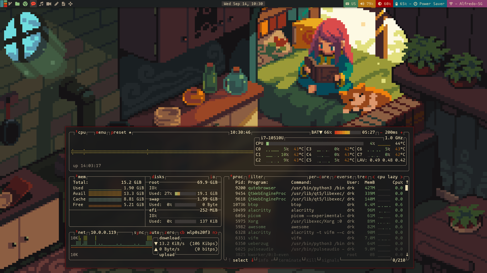
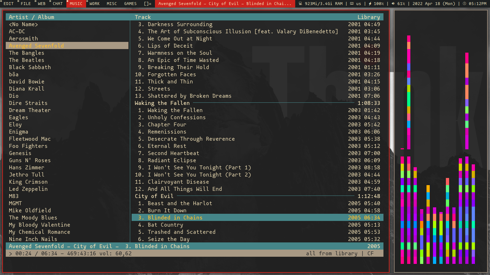

# ABOUT
This is just a personal repository where i store all my dotfiles, you're free clone them and edit them as you wish. Part of this work was based on other people's dotfiles (Distrotube for example), and it may contain scripts or binaries that they made or modify.

* Screenshots:

# Dependencies
If you want to get the full experience you need theese things:
* my dwm build (comming)
* my dmenu build (comming)
* my dwmblocks build (comming)
* my dmenu_scripts (comming)
* mononoki Nerd Font
* xbacklight
* libinput & xf86-input-libinput
* lxsession
* picom
* dunst
